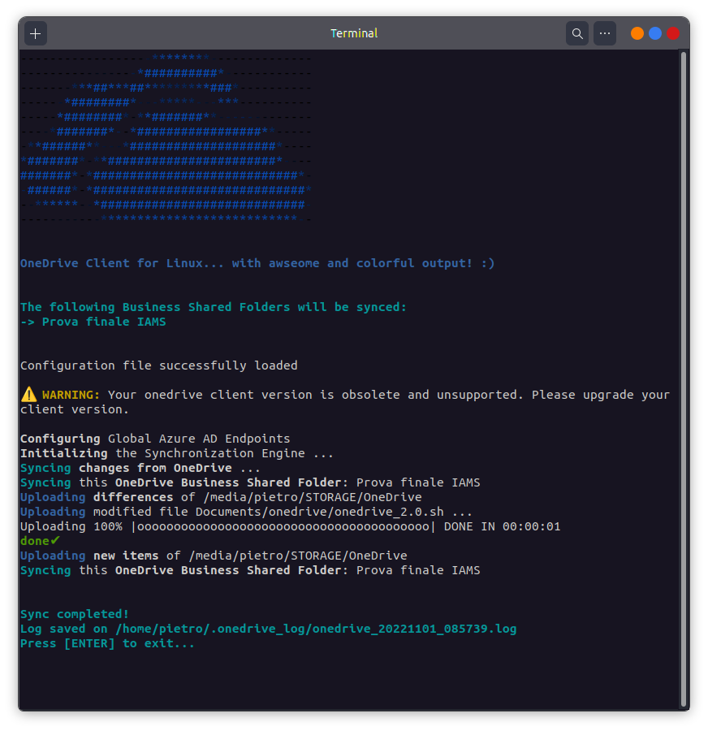

# onedrive_2.0 by TheBusyDev
Add colorful output to [OneDrive Client for Linux by abraunegg](https://github.com/abraunegg/onedrive)! Obviously, this script requires __OneDrive Client for Linux__ to be [installed](https://github.com/abraunegg/onedrive/blob/master/docs/INSTALL.md) on your system :)\
My version of __OneDrive Colorful Output__ is inspired by [this script by zzzdeb](https://github.com/zzzdeb/dotfiles/blob/master/scripts/tools/onedrive_log) - but I tried to make it as _cool_ as possible ;)\
If you have any feedback and/or suggestions to send me, I'd really appreciate it!!

## Installation
* Just download the necessary files - click the [link](https://github.com/TheBusyDev/onedrive_2.0/archive/refs/heads/main.zip) (and unzip it) or run the following command:
```text
wget https://raw.githubusercontent.com/TheBusyDev/onedrive_2.0/main/onedrive_2.0.sh
wget https://raw.githubusercontent.com/TheBusyDev/onedrive_2.0/main/onedrive_logo.txt
```

* Make the script executable: 
```text
chmod u+x ./onedrive_2.0.sh
```

* Execute the script by the command line:
```text
./onedrive_2.0.sh
```

* __WARNING:__ to work correctly, the 2 files (_onedrive_2.0.sh_ and _onedrive_logo.txt_) must be located in the same folder!

## Example
An example is given below:\

